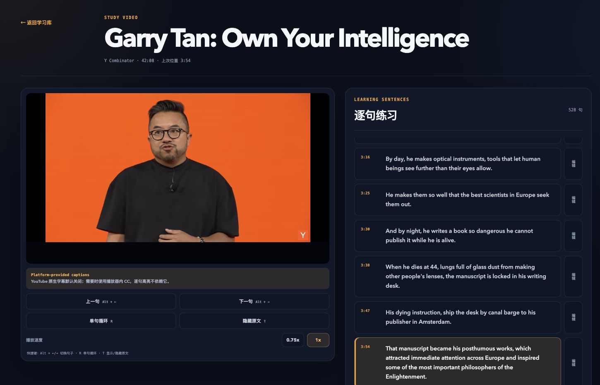

# Learn My English

一个本地优先的美式英语听力学习应用。粘贴 YouTube URL 后，应用会尝试获取已有英文 Caption Source，也可以在自动获取失败后使用学习者提供的 VTT/SRT，并通过官方 YouTube 嵌入播放器按 Learning Sentence 定位练习。

## 初步 Demo



YouTube 播放、逐句定位、当前句高亮、单句循环、倍速和本地句子编辑集中在同一个学习工作区。

## 从空环境启动

需要 [Node.js 20.9 或更高版本](https://nextjs.org/docs/app/getting-started/installation)、npm 和 Google Chrome。先确认版本，再在仓库根目录安装锁定版本的依赖：

```bash
node --version
npm --version
npm ci
cp .env.example .env.local
npm run dev
```

然后打开 [http://localhost:3000](http://localhost:3000)。点击“设置与诊断”，确认 Supadata、基础词典和浏览器本地数据状态；Supadata、`yt-dlp`、本地 AI 与 DeepSeek 都是可选项。

[Supadata Transcript API](https://docs.supadata.ai/get-transcript) 是首选字幕获取服务。在 `.env.local` 配置 `SUPADATA_API_KEY` 后，应用只会以 `mode=native` 请求 YouTube 已有字幕，不提供 `auto` 或 `generate` 配置，也不会要求 Supadata 生成 AI 转写。[Supadata 当前价格页](https://supadata.ai/pricing)列出的免费方案每月提供 100 credits；原生字幕请求和字幕不可用响应各消耗 1 credit。成功导入后 Caption Source 保存在浏览器本地，重复学习不会再次请求。

Supadata 未配置、额度不足、响应异常或没有英文字幕时，应用自动尝试 `yt-dlp`。它是非官方、可能随 YouTube 改动而失效的可选本机回退，不影响应用启动或手动字幕流程。按 [yt-dlp 官方安装说明](https://github.com/yt-dlp/yt-dlp/wiki/Installation)安装最新稳定版，确认 `yt-dlp --version` 可运行；如果可执行文件不在系统 `PATH`，把 `.env.local` 中的 `YT_DLP_PATH` 改为它的绝对路径。

`.env.local` 中的服务端配置含义如下：

| 配置 | 用途 | 是否必需 |
| --- | --- | --- |
| `SUPADATA_API_KEY` | 首选获取平台已有英文字幕 | 否；未配置时跳过 Supadata |
| `SUPADATA_API_BASE_URL` | Supadata 服务地址 | 否；默认使用官方 HTTPS v1 端点；仅本机回环测试允许 HTTP |
| `YT_DLP_PATH` | 本机回退获取公开英文字幕 | 否；可上传 VTT/SRT 替代 |
| `DICTIONARY_API_BASE_URL` | 基础英文词典 | 是；示例已给出公共服务 |
| `YOUTUBE_OEMBED_BASE_URL` | 读取公开 YouTube 元数据 | 是；示例已给出官方端点 |
| `OPENAI_BASE_URL` / `OPENAI_API_KEY` / `OPENAI_MODEL` | 本地 OpenAI 兼容服务 | 否；三项必须一起配置 |
| `OPENAI_TIMEOUT_MS` | 本地 AI 单次请求超时（毫秒） | 否；默认 15000，可设为 100–30000 |
| `DEEPSEEK_BASE_URL` / `DEEPSEEK_API_KEY` / `DEEPSEEK_MODEL` | 经同意后的云端回退 | 否；三项必须一起配置 |

不要把 `.env.local` 提交到版本库。修改配置后重启开发服务，再到“设置与诊断”重新检查状态。

## 导入第一个 Study Video

1. 在 Study Library 粘贴一个 `youtube.com/watch?v=…` 或 `youtu.be/…` 单视频链接。
2. 点击“开始导入”。应用会读取公开元数据，通过官方 IFrame Player API 检查可嵌入性与时长，然后依次尝试 Supadata native 字幕和本机 `yt-dlp` 英文字幕。
3. 如果两种自动获取方式都失败或超时，按界面提示上传有效的 `.vtt` 或 `.srt` Caption Source 继续。

导入过程会显示当前阶段。不可嵌入、不是公开内容、超过 3 小时或 Caption Source 损坏时，应用会用中文说明下一步，并且不会留下半成品 Study Video。

首次验证建议使用一个公开、可嵌入、短于 60 分钟且有英文字幕的视频。若自动字幕不可用，选择同一视频的 `.vtt` 或 `.srt` 文件；导入完成后应进入学习页，并能点击句子定位、修改句子、查词和继续上次位置。约 60 分钟与接近 3 小时的字幕会使用窗口化列表，页面不会同时创建数千个句子节点。

## 可选 AI 配置

应用可连接本地 OpenAI 兼容接口（示例地址为 `http://localhost:51448/v1`）。Base URL、API key 和模型名必须分别显式配置；应用不会猜测模型。DeepSeek 使用独立、同样显式的服务端配置：

```dotenv
OPENAI_BASE_URL=http://localhost:51448/v1
OPENAI_API_KEY=
OPENAI_MODEL=
OPENAI_TIMEOUT_MS=15000

DEEPSEEK_BASE_URL=https://api.deepseek.com
DEEPSEEK_API_KEY=
DEEPSEEK_MODEL=
```

本地 AI 用于从基础词典义项中选择当前语境，并生成单独标识的辅助例句。只有 Local AI 不可用时，应用才会考虑 DeepSeek；第一次云端回退会先用中文列出将离开设备的最小查询内容并等待明确同意。同意或拒绝保存在当前浏览器，可在“设置与诊断”中查看、撤销或重置。DeepSeek 不会接收其他字幕、Study Library 或学习记录。

中文释义默认关闭，只有学习者打开开关后才会请求。AI 未配置、同意被拒绝、超时、失败或返回无效结构时，Word Lookup 会保留可用的基础词典内容。服务端诊断只返回连接状态；Local AI 和 DeepSeek 密钥都不会进入浏览器、本地备份或 AI 缓存。

有用的最终 Word Lookup 可以保存到 Word Bank。条目会在浏览器中保留词形、所选语境词义、发音、原 Learning Sentence、Study Video 和精确时间区间；即使本地服务停止，已保存的英文内容仍可读取。中文仍默认隐藏。来源 Study Video 仍在学习库时，可从 Word Bank 回到原句并立即播放。

删除 Study Video 时，视频、学习进度和本地修订会一起移除，但 Word Bank 语境默认保留并标记为来源不可用。确认删除时可以选择同时移除只来自该视频的 Word Bank 语境；同一表达在其他 Study Video 中保存的语境不会受到影响。

“设置与诊断”可以导出 schema version 1 的 JSON 备份，覆盖 Study Library、Caption Sources、Learning Sentences、本地修订、学习进度、学习偏好、DeepSeek 同意状态、Word Lookup 缓存和 Word Bank。备份不包含 API 密钥、服务端环境配置或音视频文件。恢复前会完整校验文件；“合并”遇到同一标识但内容不同会停止整个事务，“替换”会原子清空并写入备份，因此无效、不兼容或冲突的文件都不会留下部分修改。

浏览器报告离线时，应用会停止 YouTube 播放、新 Study Video 导入以及未缓存的词典和 AI 请求，并明确显示限制；本地 Study Library、Caption Sources、Learning Sentences、Local Revisions、Word Lookup 缓存和 Word Bank 仍可查看，Local Revision 等本地操作仍可继续。已有缓存总是先于 provider 请求读取，因此 provider 停止后不会遮住已保存内容。

导入始终保留当前处理阶段。等待外部服务超过 30 秒会显示变慢提示；超过 60 秒时会强调取消操作，并在字幕获取阶段允许直接改用本地 VTT/SRT。Caption Source 限制为 10 MB，其时间轴必须位于视频时长内；provider 元数据中的地址也只接受无内嵌凭据的 HTTP(S) URL。取消、离线中断、provider 失败、无效响应和保存失败都不会创建部分 Study Video。

## 字幕获取边界

Study Video 始终通过 YouTube 官方 IFrame Player API 播放，应用不会下载、代理、缓存或托管视频与音频。字幕获取顺序固定为 Supadata `mode=native`、本机 `yt-dlp`、学习者提供的 VTT/SRT。Supadata 返回非英文内容时会被拒绝；两种自动方式取得的结果统一记录为 Platform-provided Caption Source，不猜测字幕由作者还是 YouTube 自动生成。

## 确定性验证与发布检查

```bash
npm run typecheck
npm test
npm run verify:release
```

`npm test` 会构建并启动真实的生产应用，但使用本地确定性服务替换词典、YouTube 元数据、Supadata、`yt-dlp` 和 AI 边界，因此默认测试不依赖网络、真实密钥、第三方响应速度或 Supadata credits。测试覆盖短视频、约 60 分钟和近 3 小时字幕、完整学习旅程、首查与缓存命中时限，以及浏览器响应、IndexedDB 和备份中不含测试凭证。

`npm run verify:release` 还会执行类型检查、完整端到端测试和静态安全门禁。静态门禁拒绝普通应用日志、客户端读取 Supadata/AI 密钥，以及生产浏览器资源中的已配置密钥标记。它不会把密钥内容打印出来。

## 可选的真实 provider 检查

真实服务检查有网络、限流、地区、视频可用性、YouTube 改动和 AI 费用等外部变量，所以不会混入默认测试。先用真实 `.env.local` 启动应用，再在另一个终端运行：

```bash
REAL_YOUTUBE_URL="https://www.youtube.com/watch?v=公开视频标识" npm run test:real-providers
```

运行中的应用必须配置 `SUPADATA_API_KEY` 且本机 `yt-dlp` 必须可用；所选视频必须公开、可嵌入并且 Supadata 能取得英文 native 字幕。该命令只报告检查名称、耗时和成功/失败，不输出响应正文、URL 中的凭证、字幕内容或 API key；它验证真实 YouTube 元数据、Supadata 配置、`yt-dlp` 回退就绪状态、通过 Supadata 获取的英文 Platform-provided Caption Source 和基础词典，并执行 5 秒元数据/查词与 30 秒字幕目标。

AI 检查必须额外、明确开启；固定请求只包含单词 `practice`、一条示例句和一个词典义项：

```bash
REAL_YOUTUBE_URL="https://www.youtube.com/watch?v=公开视频标识" REAL_LOCAL_AI_CHECK=1 npm run test:real-providers
REAL_YOUTUBE_URL="https://www.youtube.com/watch?v=公开视频标识" REAL_DEEPSEEK_CHECK=1 npm run test:real-providers
```

检查 DeepSeek 时，运行中的应用必须暂时不配置 Local AI，否则产品的本地优先策略会先使用 Local AI，检查将按预期失败。任何真实检查失败都应先区分应用回归与第三方波动；Supadata 失败应自动尝试 `yt-dlp`，两者都失败后仍回到学习者提供的 VTT/SRT，而不是放宽数据完整性要求。
